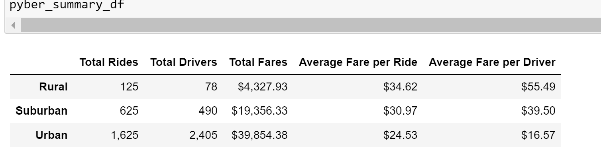
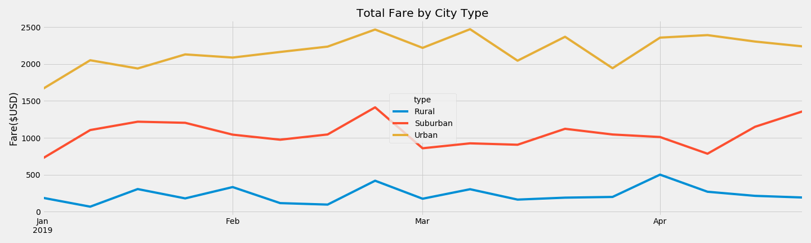

# PyBer_Analysis

Python, Jupyter Notebook, Pandas Library, CSV Files, Matplotlib

## Project Overview

The purpose of this project is to utilize Python, Pandas, and Matplotlib to create a summary table of the ride-sharing data by city type. Analyze all the rideshare data from January to end of April of 2019. Then, create a multiple-line graph that shows the total weekly fares for each city type. last, submit a written report that summarizes how the data differs by city type and how those differences can be used by decision-makers at PyBer.

## Resources

- Software: Python 3.7, Jupyter Notebook, conda version 4.8.3, Pandas Library, SciPy, NumPy, Matplotlib 3.1.3
- Data Source: city_data.csv and ride_data.csv

## Results

Ride-sharing data from data table 

   
 
    The data from the data-table showed: 
    
	1. The total rides: 125 in rural cities, 625 in suburban cities, and 1625 in urban cities. The data showed that there were 13X more rides in urban cities compared to rural cities and 2.6X more compared to suburban cities.
    
	2. Total drivers: 78 in rural cities, 490 in suburban cities, and 2405 in urban cities. The data showed that there were 31X more drivers in urban cities compared to rural cities and 5X more compared to suburban cities.
    
	3. Total fares: $ 4327.93 in rural cities, $ 19,356.33 in suburban cities, and $39,854.38 in urban cities. The data showed that the total fares were 10X more in urban cities compared to rural cities and 2X more compared to suburban cities.
    
	4. Average fare per ride: $34.62 in rural cities, $30.97 in suburban cities, and $24.53 in urban cities.  The data showed that there were 1.4X less in urban cities compared to rural cities and 1.3X less compared to suburban cities.
    
	5. Average fare per driver: $55.49 in rural cities, $39.50 in suburban cities $39.50, and $16.57 in urban cities. The data  showed that there were 3.3X less in urban cities compared to rural cities and 1.9X less compared to suburban cities.

2. The graph of the total fare by city type from January to April 2019.

 
 
The graph data is consistent with the table data; that the rural cities total fare are significantly lower than the urban cities.  Also, the graph showed that there is a parallel trend  in total fare by city type; when one goes up the other also goes up. For example, the total fare was peak at the last week of Februay in all city type, then all went down right after.

## Summary

Based on the results of the table data, I see 3 problems:  

    1.The number of rides in rural cities is too low
    2.The number of drivers in urban cities is too high
    3.The average fare per driver in urban cities is too low.
    
Therefore, my recommendations are:
    
	1. Lower the fare per ride in rural cities to encourage more riders.
	2. Reduce the number of drivers in urban cities, which will increase the average fare per driver.
	3. Increase the fare per ride in urban cities, which will also incrase the average fare per driver.

